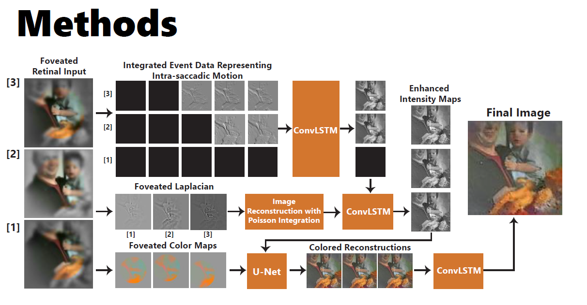
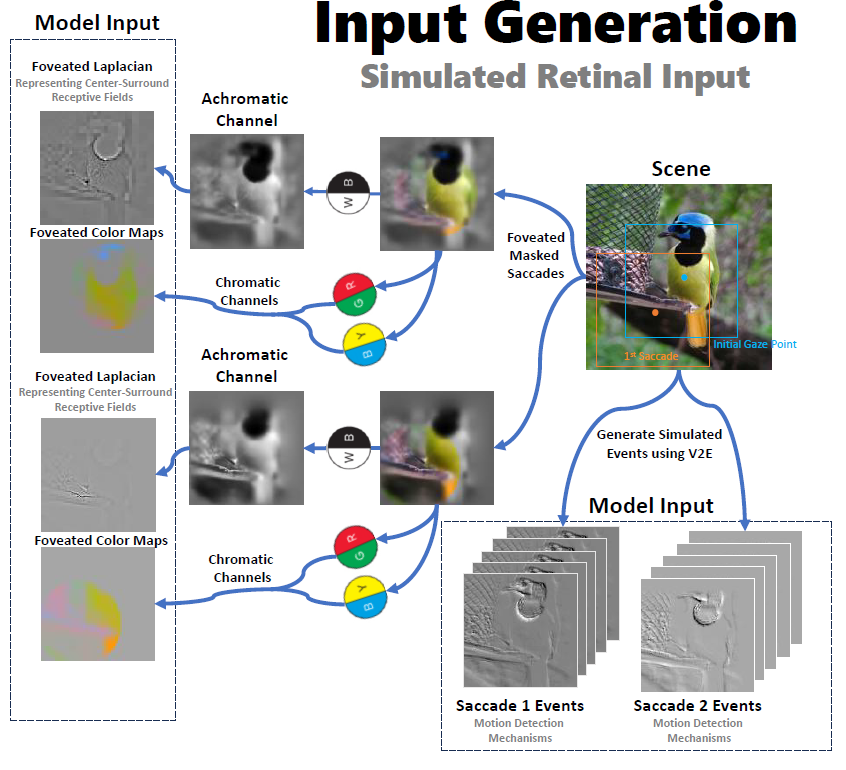

# SaccadicVision

# Reconstruction of Visually Stable Perception Using Corollary Discharge Signals-Driven ConvLSTM Neural Networks


This repository contains the code and models for the SaccadicVision project, part of my M.Sc. thesis titled "Reconstruction of Visually Stable Perception from Saccadic Retinal Inputs Using Corollary Discharge Signals-Driven ConvLSTM Neural Networks". This project was also published at the CogSci conference.

The project focuses on reconstructing visually stable perceptions from saccadic retinal inputs by leveraging corollary discharge signals using a convolutional long short-term memory (ConvLSTM) neural network. This work models how biological systems stabilize visual perception during rapid eye movements (saccades).





## Project Overview
- Thesis Title: Reconstruction of Visually Stable Perception from Saccadic Retinal Inputs Using Corollary Discharge Signals-Driven ConvLSTM Neural Networks
- Published: [Cognitive Science Conference (CogSci 2024)](https://nbel-lab.com/s/2024-Showgan-et-al.pdf)
- Field: Computational Neuroscience, Neural Networks, Vision Science
- Technologies Used: TensorFlow, Keras, ConvLSTM
- GitHub Repository: [NBELab/SaccadicVision](https://github.com/NBELab/SaccadicVision/)

## Core Contributions:
- Generation of simulated saccadic retinal input with corrolary discharge signals from simple images.
- Developed a ConvLSTM-based neural network to process saccadic retinal inputs and corollary discharge signals, emulating biological mechanisms that stabilize visual perception during eye movements.
- The model reconstructs full-color images from limited, simulated retinal inputs by utilizing intensity frames and color channels in opponent process (OPP) form.
- Corollary discharge signals provide information about eye movements, which helps the system maintain a stable perception of the visual scene.

## Dataset & Inputs:
- The model input consists of simulated saccadic retinal images and corresponding event data.
- The neural network uses both saccadic image data and motion-related event information to reconstruct a stable, full-color visual scene.


<center>

{ width=80% }

</center>


### Prerequisites
Before getting started, ensure that you have the following installed:
- Python 3.10.X
- Required Python packages (specified in `requirements.txt`)


## Getting Started
### Installation
Clone the repository:
```bash
git clone https://github.com/NBELab/SaccadicVision/
cd SaccadicVision
```
Install the required dependencies:
```bash
pip install -r requirements.txt
```
To install V2E (used for event data generation), please follow the README file in v2e folder in the project.


### Data Generation
To generate simulated retinal data, follow these steps:
1. Specify input and output paths, and any other configurations such as resolutions in `configs/data_generation_config.py`.
2. Open a terminal and navigate to the project directory.
3. Run the following command to execute `data_generation.py`:
```bash
python data_generation.py --prepate_dataset --resume --create_hdf5
```
- The `--prepate_dataset` argument is used to prepare the dataset from a folder of images.
- The `--resume` argument is optional. If provided, it allows the script to resume from a previous run. This is useful if the dataset creation process was stopped before it was finished, as it will continue from where it left off.
- The `--create_hdf5` argument is used to create an HDF5 file from the prepared dataset. This is necessary for the model.
Make sure to provide the necessary arguments according to your requirements. You can first prepare the dataset, and then separately create the HDF5 from the dataset folder as well.

4. The script will generate the simulated retinal data and save it in the specified output directory, and then create the HDF5 using the dataset generated.

### Training the Network
To train the network for image reconstruction, follow these steps:
1. Set the HDF5 file path and output folder, along with any other configurations for training in `configs/config.py`.
2. Open a terminal and navigate to the project directory.
3. Run the following command to execute `main.py`:
```bash
python main.py
```
4. The script will load the simulated retinal data, train the network, and save the reconstructed images in the specified output directory.

### Additional Notes
- Adjust the parameters in the scripts (`data_generation.py` and `main.py`) according to your requirements.
- Refer to the code comments for more detailed explanations of the implementation.

## License